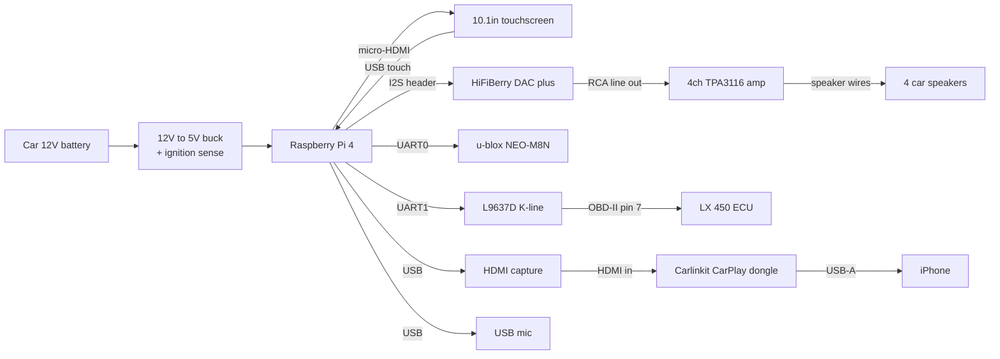

# HARDWARE.md — Bill of Materials and Wiring Plan

This is the complete parts list for the bare-metal Ada head unit, scoped to
a 1996-97 Lexus LX 450. Each section maps to a future firmware driver under
`src/` (you add specs and bodies as you implement peripherals).

---

## Target Vehicle

**1996-97 Lexus LX 450** (Toyota 80-series Land Cruiser platform, 1FZ-FE 4.5L I6)

The LX 450 is **not** pre-OBD-II. The 1996 model year was the first year
OBD-II was federally mandated in the US, and the LX 450 implements it over
**ISO 9141-2 K-line** rather than CAN. Practically:

| Property | Value |
|---|---|
| Diagnostic connector | Standard 16-pin OBD-II DLC, under driver's dash |
| Physical layer | ISO 9141-2 K-line on pin 7 (single-wire bidirectional) |
| Init | Slow init: 5-baud wakeup with key byte handshake |
| Speed | 10.4 kbaud after init |
| PID set | SAE J1979 standard PIDs (mode 0x01 + 0x09) |

This is great news for us: we read the **same standard PIDs** (RPM, vehicle
speed, coolant temp, MAF, throttle position, etc.) as a modern CAN car.
Only the physical layer differs.

**Future-proofing.** When you eventually swap to a CAN-equipped car (any US
vehicle 2008+), you can keep the same application-facing diagnostic API and
swap only the low-level driver in `src/`. The K-line transceiver gets
swapped for an MCP2515 CAN controller module.

---

## System Wiring Overview



---

## 1. Compute

| Item | Notes | Approx. cost |
|---|---|---|
| Raspberry Pi 4 Model B (4GB) | 8GB is fine but unnecessary for this workload. You already have one. | $55 |
| 32GB SanDisk Extreme A1 microSD | A1-rated for random IO. Avoid no-name cards — they fail. | $10 |
| Aluminum heatsink case with 5V fan | Cars hit 60+°C in summer. Passive-only will throttle. | $15 |

**Pin budget on the Pi:**
- HDMI 0 → display
- I2S header (GPIO 18, 19, 20, 21) → DAC HAT
- UART0 (GPIO 14/15 alt config) → GPS
- UART1 mini-UART (GPIO 14/15 default) → debug or K-line transceiver
- USB → HDMI capture, mic, touchscreen touch input
- GPIO 25 + interrupts → reserved for future MCP2515 CAN

---

## 2. Power Supply

The Pi 4 wants 5V at up to 3A. Cars give you a noisy 12-14V. We need a
buck converter rated for automotive transients (load-dump spikes), with
ignition sensing so the Pi powers down with the key.

| Item | Notes | Approx. cost |
|---|---|---|
| Mausberry Circuits "Car Supply 3A" | Has built-in ignition sense and clean shutdown signaling. Talks to Pi GPIO so the OS can shut down before power is cut. | $30 |
| OR DROK 12V→5V 5A buck + manual ignition relay | Cheaper but you wire your own ignition logic. | $10 |
| 5A ATM blade fuse + inline fuse holder | On the +12V tap, near the battery. | $5 |
| 16 AWG primary wire, ring terminals | For battery / chassis ground / ignition tap | $10 |
| (Optional) PiSugar 3 UPS hat | Survives brownouts and lets you safely shut down post-key-off. Adds ~$25 but saves SD cards from corruption. | $25 |

**Two power rails to tap in the car:**
- **Switched 12V** (ignition / accessory): primary input to the buck. Cuts when key is off.
- **Always-on 12V** (memory / battery): optional, for keeping a low-power microcontroller running to wake the Pi. Not used in v1.

---

## 3. Display

| Item | Notes | Approx. cost |
|---|---|---|
| 10.1" HDMI capacitive touchscreen, 1024×600 or 1280×800 | Waveshare 10.1" HDMI LCD (H) or generic equivalent. Prefer one that powers from 5V USB so you can tap the buck. | $80-130 |
| micro-HDMI to HDMI cable, 1m | Get one with a low-profile right-angle micro-HDMI to fit behind the dash. | $8 |

**Touch input options:**
- **USB HID (recommended for v1):** Screen exposes touch as a USB pointer
  device. On bare metal you'll need a minimal USB host stack — non-trivial
  but well-trodden. Defer until UI exists.
- **I2C touch (FT5316/GT911):** Some panels expose touch as I2C. Easier
  from bare metal (we already have BCM2711 docs, just need to write the
  I2C driver). Pick a screen that exposes the touch controller pinout.

**Action item before purchase:** confirm the screen's touch interface in
the spec sheet. I2C is the easier path for a bare-metal project.

---

## 4. Audio

Full head unit replacement: Pi feeds a DAC, DAC feeds a 4-channel amp,
amp drives the LX 450's factory speakers.

| Item | Notes | Approx. cost |
|---|---|---|
| HiFiBerry DAC+ Standard | I2S HAT, line-out RCA. Best-supported DAC on Pi. | $35 |
| TPA3116D2 4×50W class-D amp board | 12V-powered, RCA in, screw terminals out. Search "TPA3116 4 channel". | $20 |
| Metra 70-1761 Toyota wire harness adapter | Plugs into the LX 450's factory radio connector, exposes labeled wires for splicing. | $10 |
| 16 AWG speaker wire, ~25 ft | Four pairs. | $10 |
| RCA cable (DAC → amp) | 6-12 inches. | $5 |

**Note on the LX 450 audio system.** Some trims came with a factory
Nakamichi premium amp under the seat. If yours has it, you have two
options: (a) bypass the factory amp entirely (pull its harness), or
(b) feed line-level into the factory amp and skip the TPA3116. Confirm
which trim you have before buying the amp.

---

## 5. Microphone *(optional for v1)*

For future CarPlay/Siri voice input. Skip for v1; ship without it.

| Item | Notes | Approx. cost |
|---|---|---|
| USB lavalier mic | Plug-and-play, kernel sees it as USB audio class. Mount near A-pillar. | $15 |
| OR INMP441 I2S MEMS mic | Cheaper, but requires us to write an I2S input driver. | $5 |

---

## 6. GPS

| Item | Notes | Approx. cost |
|---|---|---|
| u-blox NEO-M8N module + active patch antenna | The gold standard. NMEA 0183 over UART at 9600 baud default. SBAS-capable. | $20-30 |
| 1m antenna extension w/ SMA | If mounting the antenna on the roof | $10 |

**Wiring:** GPS module powered from 5V or 3.3V (check the specific board),
TX → Pi UART0 RX (GPIO 15 in alt config), GND common with Pi.

We move GPS to the **PL011 UART0** so the mini-UART stays free for debug
or K-line. This requires a `config.txt` change and `gpio` alt-mode setup
in our boot code.

---

## 7. Vehicle Interface — LX 450 K-line

This is the LX 450-specific bit.

### Required

| Item | Notes | Approx. cost |
|---|---|---|
| **L9637D K-line transceiver IC** | DIP-8 package. Single-chip ISO 9141-2 transceiver. Handles the level shifting between 12V K-line and 3.3V TTL. | $2 |
| 0.1µF ceramic + 10µF electrolytic decoupling caps | Across the L9637D supply pins | $1 |
| 510Ω pull-up resistor (to +12V) | On the K-line side, per ISO 9141-2 | $0.10 |
| Small protoboard / perfboard | To assemble the transceiver circuit | $5 |
| OBD-II to bare-wire pigtail, 16-pin | "OBD-II breakout cable" or "OBDII pigtail". Lets you tap pins 4 (chassis GND), 5 (signal GND), 7 (K-line), 16 (+12V battery). | $10 |

### Wiring

```
LX 450 OBD-II port (pin 16, +12V) ──┬─── L9637D Vbat
                                    │
                              510Ω pull-up
                                    │
LX 450 OBD-II port (pin 7, K) ──────┴─── L9637D K
                                         L9637D RxD ──── Pi GPIO 14 (UART1 RX, mini-UART)
                                         L9637D TxD ──── Pi GPIO 15 (UART1 TX, mini-UART)
                                         L9637D GND ──── Pi GND  ──── OBD-II pin 5
```

### Software (preview, not part of this BOM)

The driver flow on bare metal:
1. ISO 9141-2 slow init: bit-bang TX low for 200ms, high for 200ms,
   then receive ECU sync byte 0x55 + key bytes 0x08 0x08
2. Switch to 10.4 kbaud UART mode
3. Send standard PID requests: `0x68 0x6A 0xF1 0x01 <PID> <checksum>`
4. Parse response

This layer belongs in a dedicated driver module under `src/` once you
define the HAL boundary (K-line may deserve its own package separate from a
future CAN stack).

### Direct-sensor fallback *(documented but not v1)*

If K-line proves flaky or you want faster updates than the ~5 Hz limit
of K-line polling, you can tap sensors directly:

- **Vehicle Speed Sensor (VSS):** Hall-effect output behind the transfer
  case, ~4 pulses per wheel revolution. Optoisolator → Pi GPIO; count
  edges over a fixed window.
- **Tach signal:** From ECU pin (consult the LX 450 service manual) or
  the negative side of an ignition coil. Same pulse-counting approach.
- **Fuel level:** Resistive sender, ~110Ω (full) to ~3Ω (empty). Voltage
  divider → MCP3008 ADC → Pi SPI.
- **Coolant temp:** NTC thermistor, similar voltage divider + ADC.

These would each need:
- 4-channel optoisolator board (4N35 or PC817-based) — $5
- MCP3008 8-channel ADC — $4

---

## 8. Future CAN-car Path

When you upgrade to any 2008+ car:

| Item | Notes | Approx. cost |
|---|---|---|
| MCP2515 + TJA1050 module | "MCP2515 CAN bus module" on AliExpress/Amazon. SPI to the Pi. | $5 |

The application-facing API can stay stable; only the `src/` CAN driver
implementation changes.

---

## 9. CarPlay (aftermarket)

We don't implement the CarPlay protocol. We treat a commercial CarPlay
dongle as just another video source.

| Item | Notes | Approx. cost |
|---|---|---|
| Carlinkit CPC200-CCPA wired CarPlay AutoBox | Or equivalent (Phoenix, Joyeauto, Ottocast). Outputs HDMI video, exposes USB audio. | $80 |
| USB HDMI capture dongle (UVC class) | Any "USB HDMI capture card" that enumerates as USB Video Class. Pi sees it as a USB camera. ~1080p30 is plenty. | $20 |
| USB-A extension to dash | For phone connection | $5 |

**Software architecture:** the Pi enumerates the HDMI capture as a UVC
device, pulls frames into a buffer, and one of our UI pages (`ui-pages-
carplay.adb`) renders those frames full-screen. Phone audio comes back
via the dongle's USB audio output, mixes with our own audio in software,
and goes out the DAC.

This is a **v2** feature. Bare-metal USB host + UVC + USB audio is a real
chunk of work. Doesn't block firmware development; the head unit ships
useful without it.

---

## 10. Cabling, Connectors, Install

| Item | Notes | Approx. cost |
|---|---|---|
| Metra 95-8202 dash kit (Toyota 80-series 2-DIN) | Adapts the LX 450's factory radio bay to standard 2-DIN. Will need trimming/modification to fit the touchscreen — be prepared to Dremel. | $25 |
| Wire loom / split tubing, 1/4" and 1/2" | Tidy installs. | $10 |
| Butt connectors, ring terminals, heat-shrink | Misc. | $15 |
| Assorted ATM blade fuses (5A, 10A, 15A) | $5 |

---

## 11. Bench Test Kit (highly recommended)

Buy these *first*. They make every other purchase 10x more debuggable.

| Item | Notes | Approx. cost |
|---|---|---|
| **Saleae Logic 8 clone (8-channel, 24MHz)** | Indispensable for K-line, I2S, UART, SPI debugging. Real Saleae is $400; clone is $15 and works fine with PulseView. | $15 |
| **USB-to-TTL serial adapter (CP2102 or FT232)** | Plugs into your laptop USB and the Pi's UART pins. Lets you watch UART output without a screen. | $8 |
| **12V variable bench supply** | 12V/5A capable, current-limited. Test the buck and the K-line circuit on the bench, not in the car. | $50-100 |
| **Cheap multimeter** | If you don't already have one. | $20 |
| **Breadboard + jumper wire kit** | For the L9637D circuit before committing to perfboard. | $15 |

---

## 12. Budget Summary

### Must-have for v1 (boots, drives screen, plays audio, reads GPS)

| Subsystem | Cost |
|---|---|
| Compute (assuming Pi already in hand) | $25 |
| Power (Mausberry + fuses + wire) | $50 |
| Display (10.1" HDMI capacitive touch) | $100 |
| Audio (DAC + amp + harness + wire) | $80 |
| GPS (u-blox NEO-M8N + antenna) | $25 |
| Cabling + dash kit + connectors | $55 |
| Bench tools (logic analyzer + UART adapter + breadboard) | $40 |
| **v1 subtotal** | **~$375** |

### Adds K-line OBD-II (read RPM, speed, coolant, etc.)

| Subsystem | Cost |
|---|---|
| L9637D + passives + protoboard + OBD-II pigtail | $20 |
| **v1 + K-line** | **~$395** |

### v2 — CarPlay integration

| Subsystem | Cost |
|---|---|
| Carlinkit CarPlay dongle | $80 |
| USB HDMI capture | $20 |
| USB mic | $15 |
| **v2 add-on** | **~$115** |

### v3 — Future CAN car path

| Subsystem | Cost |
|---|---|
| MCP2515 + TJA1050 module | $5 |
| **v3 add-on** | **~$5** |

---

## What to Buy First

If you want to start writing peripheral drivers right now, in order of
"unlocks the most code per dollar":

1. **Bench tools** ($40) — logic analyzer + USB-UART adapter. Buy these
   today. Every other peripheral becomes trivially debuggable.
2. **GPS module** ($25) — wire to Pi UART, write NMEA parser, see your
   position on the UART log. Pure software win, no car involved.
3. **OBD-II pigtail + L9637D + breadboard** ($20) — implement K-line on
   the bench using the bench supply. Test against the LX 450 only after
   the bench rig is solid.
4. **Display** ($100) — once you have something to show, buy the screen.
5. **Audio chain** ($80) — DAC and amp last; audio is the hardest to
   bench-test without speakers.
6. **Power + cabling + dash kit** ($55) — when you're ready to install
   in the car.

Total to "start writing real drivers": **~$85** for bench tools + GPS +
K-line bench rig.
